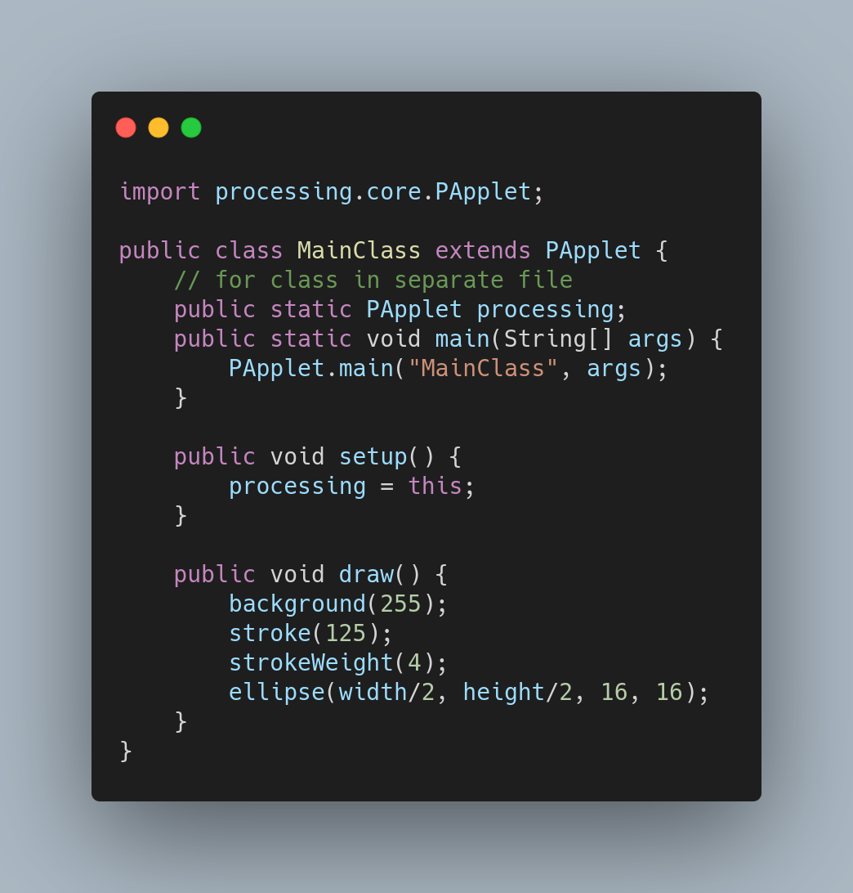

## How to use Processing 3 on IntelliJ IDEA?

Honestly, Processing IDE is fine to work with but the missing of auto-completion is a bit annoying and considered not productive.

There's no doubt that IntelliJ IDEA has the most productive coding assitance, which helps us stay focused on ideas rather than dealing with typos, errors or syntax... So, getting Processing 3 worked with IntelliJ IDEA is worth to try.

There are a lot of workarounds, below is based on an [answer](https://stackoverflow.com/questions/36765288/how-to-use-processing-3-on-intellij-idea) from __stackoverflow__:

__Step 1__: Add the Processing library to your classpath. This includes the core and any JOGL dependencies you need.

__Setp 2__: Create a class that extends `PApplet` and add your code there.

__Step 3__: Call `PApplet.main("YourSketchNameHere");` to launch your sketch.

Here is a little example that shows those steps:

