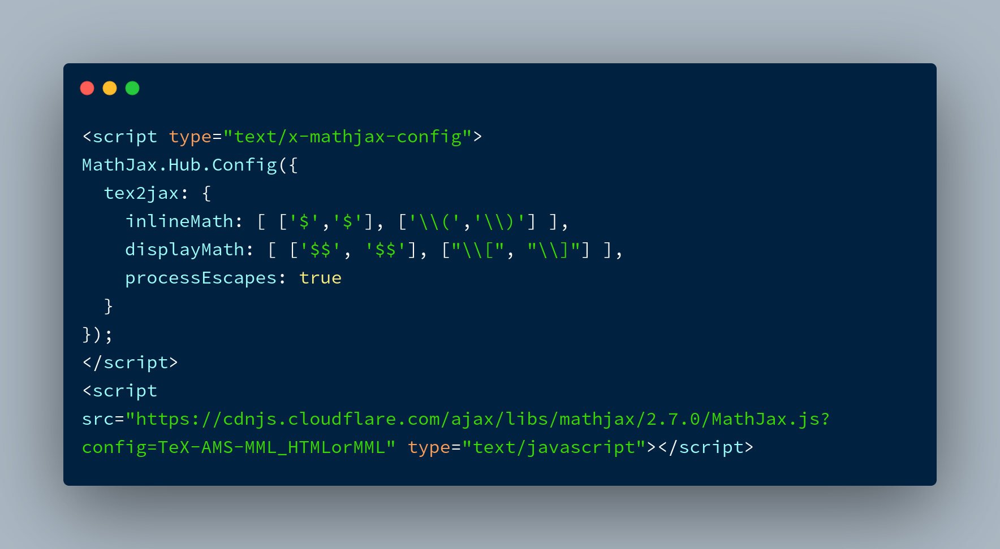

Simple tweak to get Jekyll working with math equations using MathJax.

### Enabling [MathJax](https://www.mathjax.org/)

Insert the code below in your `_layout/default.html`

### Use $\LaTeX$ to write equations

For example, use `$$ Q(N, V, T) = sum_j e^{\beta E_{N,j}} $$` for _display_ equation

$$Q(N, V, T) = \sum_j e^{\beta E_{N,j}}$$

Or use `$x_n = x_{n-1} + x_{n-2}$` for _inline_ equation, $x_n = x_{n-1} + x_{n-2}$.
